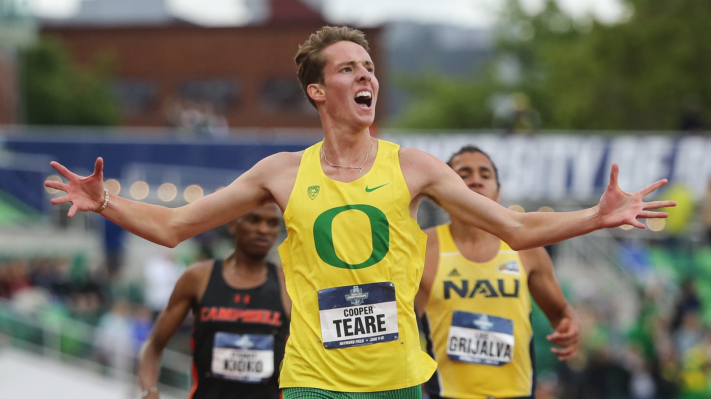
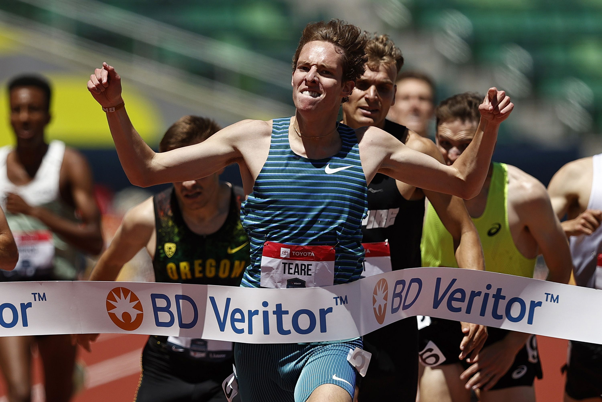

# Who is Cooper Teare?

Cooper Teare is a former University of Oregon Duck and is currently racing professionally as a distance runner for Nike.

## Collegiate Accomplishments

As a Duck, Cooper Teare won two NCAA titles:
- Outdoor 5000 meters - 13:12.27 (2021)
- Indoor distance medley relay - 9:19.98 (2021)

_Cooper Teare winning the NCAA 5000 meter finals_

He also holds two NCAA records:
- Indoor mile - 3:50.39 (2021)
- Indoor distance medley relay - 9:19.42 (2021)

Other achievments:
- Pac-12 Champion for the 1500 meters (2021)
- NCAA indoor championship runnerup for 3000 meters (2021)

## Professional Career

- Cooper Teare recently joined the Nike supported Bowerman Track Club
- Second fastest American to run indoor mile - 3:50.17 (2022)
- US 1500 meters Champion - 3:45.86 (2022)

_Cooper Teare winning the US 1500 meter finals_

## Social Media
- Instagram: [cooperteare](https://www.instagram.com/cooperteare/?hl=en)
- Twitter: [cooperteare](https://twitter.com/cooperteare?lang=en)

I love Cooper Teare!!
